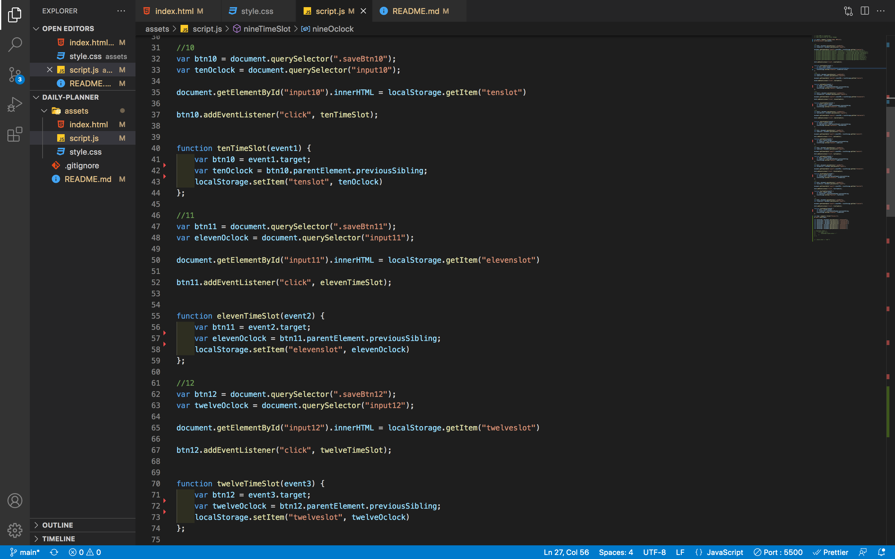

# daily-planner

# Description

### Ever have a hard time planning your day? We've all been there. With this daily planner you are able to plan your day with ease. From 9AM to 5PM, this planner will show you the current hour in grey, previous hours in red, and future hours in green. Perfect and easy way to keep track of scheduling.

# Features

### This project includes saving text to local storage and persisting the value that the user inputs. Includes the current time, day, month, and date. As stated above, this project shows you the current time in grey, previous hours in red, and future hours in green.

# Usage

### 

### In the screenshot above shows how the users input is stored to the local storage, which persists the value. This enables that value to be used for later use such as making a todo list or making a daily planner like this one.

# Languages Used

### HTML, CSS, JavaScript, and Moment.js were used in this project

# Link
